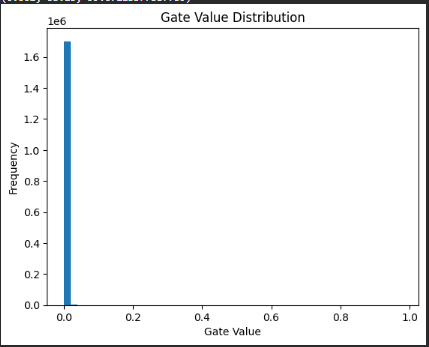

# Self-Pruning Neural Network Report

## 1. Why L1 Penalty on Sigmoid Gates Encourages Sparsity

In this model, each weight is associated with a learnable gate parameter. These gate scores are passed through a sigmoid function, producing values between 0 and 1.

The sparsity loss is defined as the L1 norm (sum) of all gate values:

Sparsity Loss = Σ sigmoid(gate_scores)


L1 regularization is known to encourage sparsity because it penalizes non-zero values linearly. Since all gate values lie in the range (0,1), minimizing their sum encourages many of them to move toward 0.

When a gate value approaches 0, the corresponding weight is effectively removed from the network:

pruned_weight = weight × gate ≈ 0


Thus, the network learns to:
- Keep important connections (gates near 1)
- Remove unimportant ones (gates near 0)

This results in a sparse and efficient model.

---

## 2. Results Summary

| Lambda (λ) | Test Accuracy (%)| Sparsity Level (%) |
|------------|------------------|--------------------|
| 1e-5       | 55.35%           | 18.77%             |
| 1e-4       | 57.06%           | 74.77%             |
| 1e-3       | 53.15%           | 99.07%             |

---

## 3. Analysis of Results

- For **low λ (1e-5)**:
  - The sparsity penalty is weak
  - Most gates remain active
  - High accuracy but low sparsity

- For **medium λ (1e-4)**:
  - Balanced trade-off
  - Some weights are pruned
  - Slight drop in accuracy but improved efficiency

- For **high λ (1e-3)**:
  - Strong sparsity pressure
  - Many gates driven close to zero
  - High sparsity but noticeable accuracy drop

The results clearly demonstrate a trade-off: increasing λ improves sparsity but reduces accuracy, highlighting the balance between model efficiency and predictive performance.

---

## 4. Gate Value Distribution (Best Model)

Below is the distribution of gate values for the best-performing model:

```python


